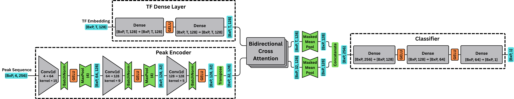
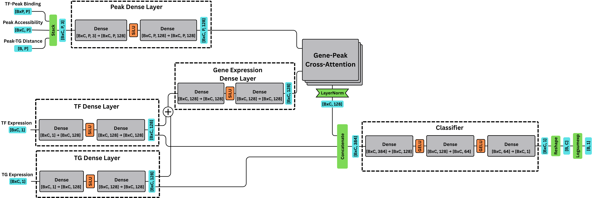

# Model Architecture

## TF-DNA Binding Model

  

### TF Dense Layer
The TF dense layer casts a ProsT5 encoded TF embedding to the size of the model's hidden dimension (default 128) using two fully connected MLP layers.

### Peak Encoder
The peak encoder layer uses a series of three 1D convolutional neural networks to summarize, condense, and embed information about the DNA sequence from a one-hot encoded peak sequence. 

1. **Conv1d Layer 1:** This layer summarizes groups of 15 nucleotides, reducing the peak sequence length while expanding the embedding dimension to capture information about groups of nucleotides that are roughly the size of a TF binding motif.
    - In channels: 4 (one for each nucleotide in the one-hot encoding)
    - Out channels: 64
    - Kernel size: 15
    - Stride: 1
    - Padding: 7
    - MaxPool1d: 4

2. **Conv1d Layer 2:** This layer further reduces the size of the sequence dimension and expands the embedding dimension.
    - In channels: 64
    - Out channels: 128
    - Kernel size: 9
    - Stride: 1
    - Padding: 4
    - MaxPool1d: 4

3. **Conv1d Layer 3:** This layer expands the embedding dimension to the final hidden dimension shape of the model (default: 128)
    - In channels: 128
    - Out channels: `hidden_dim`
    - Kernel size: 5
    - Stride: 1
    - Padding: 2
    - MaxPool1d: None

### Bidirectional Cross Attention

Uses the `bidirectional-cross-attention` package from [lucidrains](https://github.com/lucidrains/bidirectional-cross-attention). Bidirectional cross attention allows two data modalities to jointly attend to one another. This module allows the TF embedding to query the DNA embedding and the DNA embedding to query the TF embedding. This produces separate outputs for the TF and DNA queries. These are mean pooled and concatenated to combine them.

### Classifier

The classifier layer contains three dense MLP networks. The concatenated TF and DNA tokens from the attention layer are passed through the network to reduce the dimensionality to a single prediction logit.

 
 

## TF-TG Regulation Model

  

### Peak Binding Prediction
The weights of the organism's trained TF-DNA model are frozen and used to predict the binding potential of the TF to each peak within 100 kb of the TG's TSS. This is stacked with each peak's accessibility and distance to the TG's TSS. 

### Peak Dense Layer
The stacked peak information is passed through two MLP layers to cast the three scalar values up to the dimensionality of the model. 

### TF and TG Dense Layers
The TF expression and TG expression values are passed through separate embedding layers that cast the scalar expression value up to the hidden dimension size of the model. 

### Gene Expression Dense Layer

The TF and TG expression embeddings are summed and passed through a dense layer to combine the gene expression information.

### Gene to Peak Cross Attention Layer
The combined gene expression embedding queries key/value pairs from the peak information embedding. This allows the model to learn how to associate the peak accessibility, peak to gene distance, and TF binding potential for all peaks near the TG with the TF and TG expression patterns to make predictions about whether the TF regulates the TG.

### Classifier Layer
The output from the gene to peak cross attention layer is concatenated with the TF expression embedding and the TG expression embedding. The attention layer provides information about the regulatory landscape and ability of the TF to bind nearby, while the direct expression information provides information about whether the TF and TG are expressed in a given cell. 

The classifer layer reduces the dimensionality of the data from 3*`hidden_dimension` to a single scalar prediction for each cell in the batch. The predictions are then logsumexp pooled to generate a final prediction logit for the TF-TG edge.